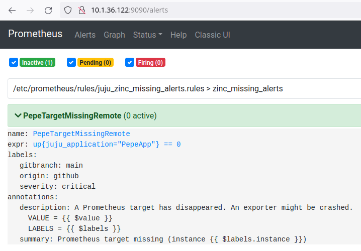

# Sync alert rules from git

In this tutorial you will learn how to make COS Lite automatically sync the alert rules of a git repository to Prometheus using the [COS Configuration charm](https://charmhub.io/cos-configuration-k8s/docs).


## Prerequisites
This tutorial assumes that you already have the following:
- A Kubernetes deployment [bootstrapped with Juju](https://documentation.ubuntu.com/juju/latest/tutorial/).
- A git repository with your Prometheus Alert rules.

## Introduction

Imagine your business is looking to migrate your observability solution to COS Lite, but that you already have a lot of time invested into converting operational knowledge into alert rules that you're versioning in a git repository.

## Create a juju model

Start out by creating a Juju model, in which we will later deploy our applications.

```bash
$ juju add-model cos
```

Now, verify that your model is empty and ready:

```bash
$ juju status

Model  Controller           Cloud/Region        Version  SLA          Timestamp
cos    charm-dev-batteries  microk8s/localhost  3.0.3    unsupported  17:21:00-03:00

Model "admin/cos" is empty.
```

## Deploy the Prometheus charm

```bash
$ juju deploy prometheus-k8s prometheus --channel stable
```

After a few seconds, the Prometheus charm is up and running:

```bash
$ juju status --relations

Model  Controller           Cloud/Region        Version  SLA          Timestamp
cos    charm-dev-batteries  microk8s/localhost  3.0.3    unsupported  17:26:56-03:00

App         Version  Status  Scale  Charm           Channel  Rev  Address         Exposed  Message
prometheus  2.33.5   active      1  prometheus-k8s  stable   103  10.152.183.235  no

Unit           Workload  Agent  Address      Ports  Message
prometheus/0*  active    idle   10.1.36.122

Relation provider            Requirer                     Interface         Type  Message
prometheus:prometheus-peers  prometheus:prometheus-peers  prometheus_peers  peer
```

## Deploy the COS Configuration charm 

The COS Configuration charm will be used to poll a git repository of our choice on a recurring basis, making sure changes are pulled, processed and forwarded to Prometheus. 

After deploying the charm, we will also need to provide some configuration:

- `git_repo`: URL to repository to clone and sync against.
- `git_branch`: The git branch to check out.
- `git_depth`: Cloning depth, to truncate commit history to the specified number of commits. Zero means no truncating.
- `prometheus_alert_rules_path`: Relative path in repository to prometheus rules.

Now, let's deploy it:

```bash
$ juju deploy cos-configuration-k8s cos-config \
    --config git_repo=https://github.com/Abuelodelanada/cos-config \
    --config git_branch=main \
    --config git_depth=1 \
    --config prometheus_alert_rules_path=rules/prod/prometheus/
```

At this moment, our model looks like this:

```bash
$ juju status --relations

Model  Controller           Cloud/Region        Version  SLA          Timestamp
cos    charm-dev-batteries  microk8s/localhost  3.0.3    unsupported  17:43:03-03:00

App         Version  Status  Scale  Charm                  Channel  Rev  Address         Exposed  Message
cos-config  3.5.0    active      1  cos-configuration-k8s  stable    15  10.152.183.147  no
prometheus  2.33.5   active      1  prometheus-k8s         stable   103  10.152.183.235  no

Unit           Workload  Agent  Address      Ports  Message
cos-config/0*  active    idle   10.1.36.124
prometheus/0*  active    idle   10.1.36.122

Relation provider            Requirer                     Interface                  Type  Message
cos-config:replicas          cos-config:replicas          cos_configuration_replica  peer
prometheus:prometheus-peers  prometheus:prometheus-peers  prometheus_peers           peer
```

## Relate Prometheus to COS Configuration

Once we execute this command:

```bash
$ juju relate prometheus cos-config
```


we will get both charms related:

```bash
$ juju status --relations
Model  Controller           Cloud/Region        Version  SLA          Timestamp
cos    charm-dev-batteries  microk8s/localhost  3.0.3    unsupported  17:51:33-03:00

App         Version  Status  Scale  Charm                  Channel  Rev  Address         Exposed  Message
cos-config  3.5.0    active      1  cos-configuration-k8s  stable    15  10.152.183.147  no
prometheus  2.33.5   active      1  prometheus-k8s         stable   103  10.152.183.235  no

Unit           Workload  Agent  Address      Ports  Message
cos-config/0*  active    idle   10.1.36.124
prometheus/0*  active    idle   10.1.36.122

Relation provider             Requirer                     Interface                  Type     Message
cos-config:prometheus-config  prometheus:metrics-endpoint  prometheus_scrape          regular
cos-config:replicas           cos-config:replicas          cos_configuration_replica  peer
prometheus:prometheus-peers   prometheus:prometheus-peers  prometheus_peers           peer
```

## Verification

After setting the `git_repo` (and optionally `git_branch`), the contents should be present in the workload container,

```bash
$ juju ssh --container git-sync cos-config/0  ls -l /git

total 4
drwxr-xr-x 3 root root 4096 Feb 23 20:40 dd2cc335a9b5734e0adbb25681074b09a4c3a111
lrwxrwxrwx 1 root root   40 Feb 23 20:40 repo -> dd2cc335a9b5734e0adbb25681074b09a4c3a111
```

and accessible from the charm container

```bash
$ juju ssh cos-config/0 ls -l /var/lib/juju/storage/content-from-git/0

total 4
drwxr-xr-x 3 root root 4096 Feb 23 20:40 dd2cc335a9b5734e0adbb25681074b09a4c3a111
lrwxrwxrwx 1 root root   40 Feb 23 20:40 repo -> dd2cc335a9b5734e0adbb25681074b09a4c3a111
```

After relating to e.g. prometheus, rules from the synced repository should appear in app data,

```bash
$ juju show-unit prometheus/0 \
    --format json \
    | jq '."prometheus/0"."relation-info"'

[
  {
    "relation-id": 0,
    "endpoint": "prometheus-peers",
    "related-endpoint": "prometheus-peers",
    "application-data": {},
    "local-unit": {
      "in-scope": true,
      "data": {
        "egress-subnets": "10.152.183.235/32",
        "ingress-address": "10.152.183.235",
        "private-address": "10.152.183.235"
      }
    }
  },
  {
    "relation-id": 2,
    "endpoint": "metrics-endpoint",
    "related-endpoint": "prometheus-config",
    "application-data": {
      "alert_rules": "{\"groups\": [{\"name\": \"zinc_missing_alerts\", \"rules\": [{\"alert\": \"PepeTargetMissingRemote\", \"annotations\": {\"description\": \"A Prometheus target has disappeared. An exporter might be crashed.\\n  VALUE = {{ $value }}\\n  LABELS = {{ $labels }}\", \"summary\": \"Prometheus target missing (instance {{ $labels.instance }})\"}, \"expr\": \"up{juju_application=\\\"PepeApp\\\"} == 0\", \"for\": \"0m\", \"labels\": {\"gitbranch\": \"main\", \"origin\": \"github\", \"severity\": \"critical\"}}]}]}"
...
```

as well as in prometheus itself using the command line:

```bash
$ juju ssh prometheus/0 curl localhost:9090/api/v1/rules

{"status":"success","data":{"groups":[{"name":"zinc_missing_alerts","file":"/etc/prometheus/rules/juju_zinc_missing_alerts.rules","rules":[{"state":"inactive","name":"PepeTargetMissingRemote","query":"up{juju_application=\"PepeApp\"} == 0","duration":0,"labels":{"gitbranch":"main","origin":"github","severity":"critical"},"annotations":{"description":"A Prometheus target has disappeared. An exporter might be crashed.\n  VALUE = {{ $value }}\n  LABELS = {{ $labels }}","summary":"Prometheus target missing (instance {{ $labels.instance }})"},"alerts":[],"health":"ok","evaluationTime":0.000263312,"lastEvaluation":"2023-02-23T20:55:06.506298391Z","type":"alerting"}],"interval":60,"limit":0,"evaluationTime":0.000272579,"lastEvaluation":"2023-02-23T20:55:06.50629195Z"}]}}
```

or using Prometheus Web UI:


 

## Sync interval

The repository syncs on every [`update-status` event](https://documentation.ubuntu.com/juju/latest/reference/hook/#update-status) or when the juju administrator manually runs the `sync-now` action.

```shell
$ juju run cos-config/0 sync-now
Running operation 1 with 1 task
  - task 2 on unit-cos-config-0

Waiting for task 2...
18:10:28 Calling git-sync with --one-time...
18:10:29 Warning: I0223 21:10:28.544402     186 main.go:473] "level"=0 "msg"="starting up" "pid"=186 "args"=["/git-sync","--repo","https://github.com/Abuelodelanada/cos-config","--branch","main","--rev","HEAD","--depth","1","--root","/git","--dest","repo","--one-time"]

git-sync-stdout: ""
```

## Extra information

In addition to forwarding alert rules to Prometheus, the COS Configuration 
 is also capable of forwarding alert rules to Loki, as well as dashboards to Grafana.

If you would like to sync these resources as well, set the paths for Loki alert rules and Grafana dashboard file as well:

```shell
$ juju config cos-config loki_alert_rules_path=rules/prod/loki/
$ juju relate cos-config loki-k8s

$ juju config cos-config grafana_dashboards_path=dashboards/prod/grafana/
$ juju relate cos-config grafana-k8s
```